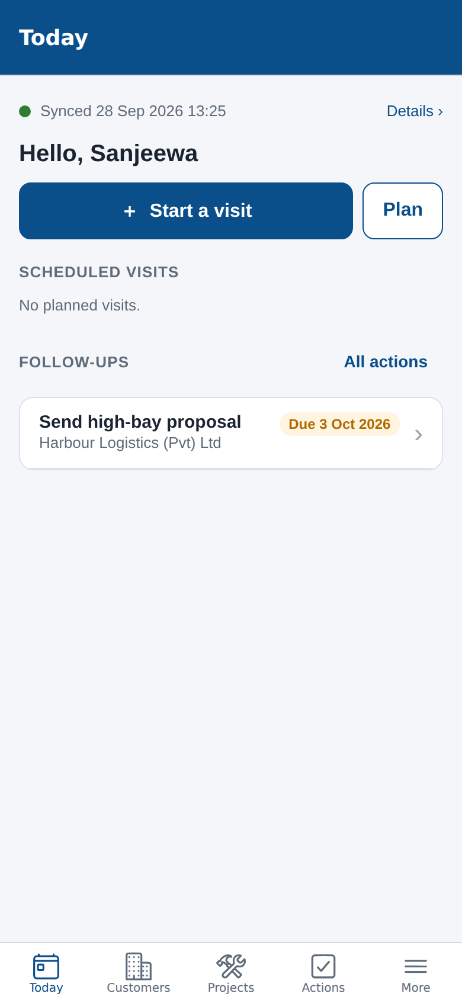
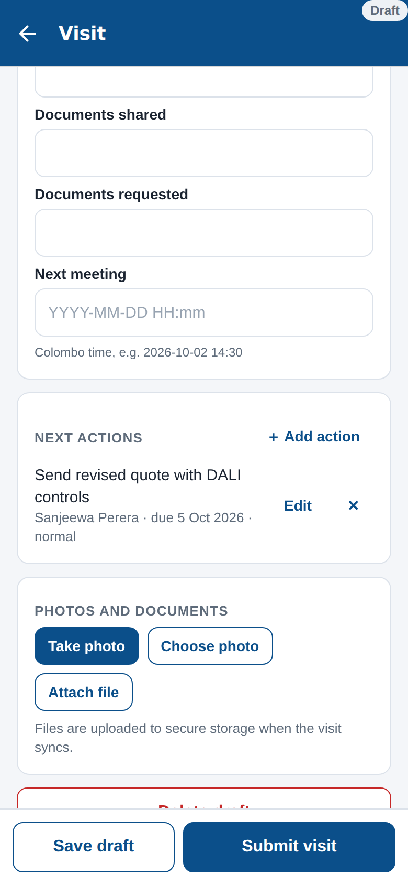
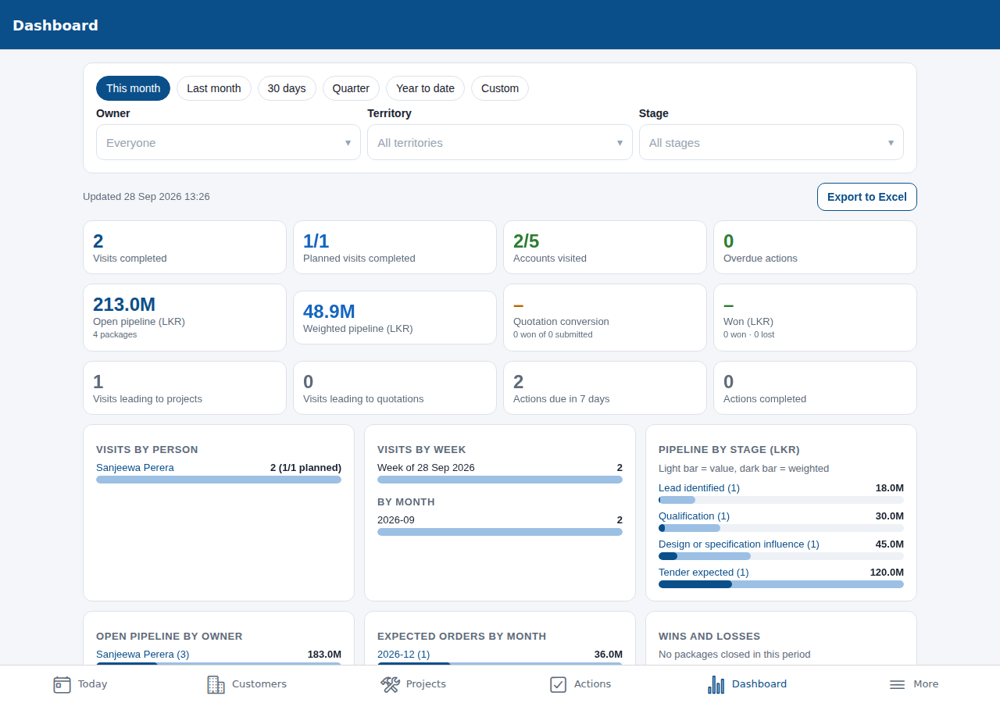

# DIMO Sales – visit and project tracking

A mobile app (iOS and Android) for DIMO Lighting salespeople to record customer visits and project intelligence at the time of the visit, plus a web dashboard for managers and administrators. The database is the single source of truth, and it produces a controlled Excel workbook for analysis and sharing.

Built from *Sales Visit and Project Tracking App Requirements* (28 September 2026). **Release 1 and Release 2 are both included.** Items that need DIMO decisions or external systems are listed at the end.

| Salesperson (phone) | Visit capture | Manager dashboard (web) |
|---|---|---|
|  |  |  |

## What's in it

**Field app (works offline)**
* Daily agenda: planned visits, overdue and upcoming follow-ups, drafts and sync status.
* Visit capture: check-in/out time, optional one-off GPS with consent, remote flag, people met, projects and packages, discussion, commercial signal, outcome, next actions, and photos/files.
* Everything autosaves as a draft. Submit validates the required fields and queues the visit. Sync is automatic and **safe to retry** (no duplicates), and each visit shows Draft / Queued / Synced / Needs attention.
* You can create a customer, contact, project and package **from within a visit**. The customer and the people met become project stakeholders without being typed twice, and possible duplicates are shown before anything is created.
* Customer, contact and project profiles with full visit and action history. Packages move through stages with configurable rules. Quotations and revisions, design/submittal milestones, technical notes, and attachments.
* Local reminders before actions are due. Correction requests for submitted visits.

**Management (web or phone)**
* Dashboard with visits by person, week and month; planned versus completed; accounts visited and not visited; visits leading to projects and quotations; overdue actions; pipeline by stage, owner, segment and expected order month; weighted pipeline; tender deadlines; quotation conversion; wins, losses and reasons; and stale projects. Figures update in real time and every chart drills down to its records.
* Excel export on demand and on a schedule: a Read Me sheet, a Summary sheet, and flat sheets for Customers, Contacts, Visits, Visit Contacts, Projects, Opportunities, Project Stakeholders, Actions, Quotations and Audit Log. Columns and IDs are stable, dates are ISO, currency codes are included and there are no merged cells. [Sample workbook](docs/sample/DIMO_Sales_Export_sample.xlsx).
* Automated alerts: daily email and push digests, automatic escalation of long-overdue actions, and tender deadline notices.
* Administration: users, roles, territories, dropdown lists, pipeline stages, settings, exchange rates, customer import, audit log, and user offboarding with record reassignment.

**Security:** all permissions are enforced in the database (row-level security) for four roles: salesperson, sales manager, estimator/designer and administrator. Cost and margin are restricted by role, and every change and export is attributable. See [docs/SECURITY_AND_SYNC.md](docs/SECURITY_AND_SYNC.md).

## Architecture

```
Expo app (iOS / Android / web)  ──HTTPS──>  Supabase
  expo-router screens (src/app)              PostgreSQL + RLS  (supabase/migrations)
  offline cache + outbox (SQLite)            Auth (email, Microsoft Entra ID)
  sync engine (src/lib/sync.ts)              Storage (attachments, exports)
  Excel builder (shared)                     Realtime (dashboard)
                                             Edge Functions: admin-users, scheduled-export, daily-alerts
```

## Repository layout

```
src/app/                 Screens (Expo Router). (app)/(tabs): Today, Customers, Projects, Actions, Dashboard, More
src/components/          UI kit, form controls, pickers, charts
src/lib/                 Supabase client, session, offline cache, outbox, sync, reminders, GPS, media, export
supabase/migrations/     Schema, business rules, security policies, API functions, reference data, automation
supabase/functions/      Edge Functions + _shared (xlsx writer and workbook definition, also used by the app)
supabase/seed.sql        Demo users and data for local development
supabase/tests/          Acceptance tests (brief section 8) and local Supabase stand-in
scripts/                 test-db.sh, api-smoke-test.mts, gen_field_dictionary.py
docs/                    Field dictionary, data model, security and sync policy, API, deployment, guides, testing
```

## Getting started

```bash
npm install
cp .env.example .env        # set EXPO_PUBLIC_SUPABASE_URL / EXPO_PUBLIC_SUPABASE_ANON_KEY
npx expo start              # w = web dashboard; i / a = development build on a phone
```

The database, Edge Functions, schedules, Microsoft sign-in, EAS builds and backups are covered in [docs/DEPLOYMENT.md](docs/DEPLOYMENT.md). Demo sign-ins (local seed): `sales1@dimo.test`, `manager@dimo.test` and others, all with password `Dimo#2026`.

## Checks

```bash
npx tsc --noEmit
npx expo lint
scripts/test-db.sh           # database acceptance tests (needs a local PostgreSQL)
```

See [docs/TESTING.md](docs/TESTING.md).

## Documentation

* [Field dictionary](docs/FIELD_DICTIONARY.md): every field's type, allowed values, mandatory status, validation and edit permission
* [Data model](docs/DATA_MODEL.md)
* [Security, offline sync and data policies](docs/SECURITY_AND_SYNC.md): deduplication rule, sync and conflict policy, GPS, retention, backup and recovery, dashboard refresh
* [API](docs/API.md)
* [Deployment](docs/DEPLOYMENT.md)
* [User guide](docs/USER_GUIDE.md) and [administrator guide](docs/ADMIN_GUIDE.md)

## Decisions for DIMO (brief section 9)

These are configurable or have placeholder defaults. Please confirm them:

| Decision | Current default | Where to change |
|---|---|---|
| Territories and business units | 9 provinces + "Key accounts / Government", one business unit | Admin › Territories |
| Official sales stages and probabilities, required exit fields | The brief's suggested stages, 5–100% | Admin › Pipeline stages |
| Visit GPS mandatory or optional | Optional (`gps_required = false`) | Admin › Settings |
| Who may see quotation cost and margin | Manager, Administrator | `margin_visible_roles` |
| Microsoft 365 sign-in | Supported, off by default | DEPLOYMENT.md §3 |
| Excel destination | Download in the app, plus scheduled exports emailed as a secure link | Export screen |
| Reporting frequency | Daily / weekly / monthly schedules available | Export screen |
| Attachment retention and size limit | Kept with the record; 25 MB, images/PDF/Office/CAD | Storage bucket settings |
| App identifiers | `lk.dimo.sales` | `app.json` |

**Not included:** these need DIMO's systems or decisions first.
* Integration with a specific ERP/CRM. The REST API and data export are ready for it.
* Direct SharePoint/OneDrive delivery of the workbook.
* Map views. Visits and sites link out to Google Maps.
* Voice notes and transcription.
